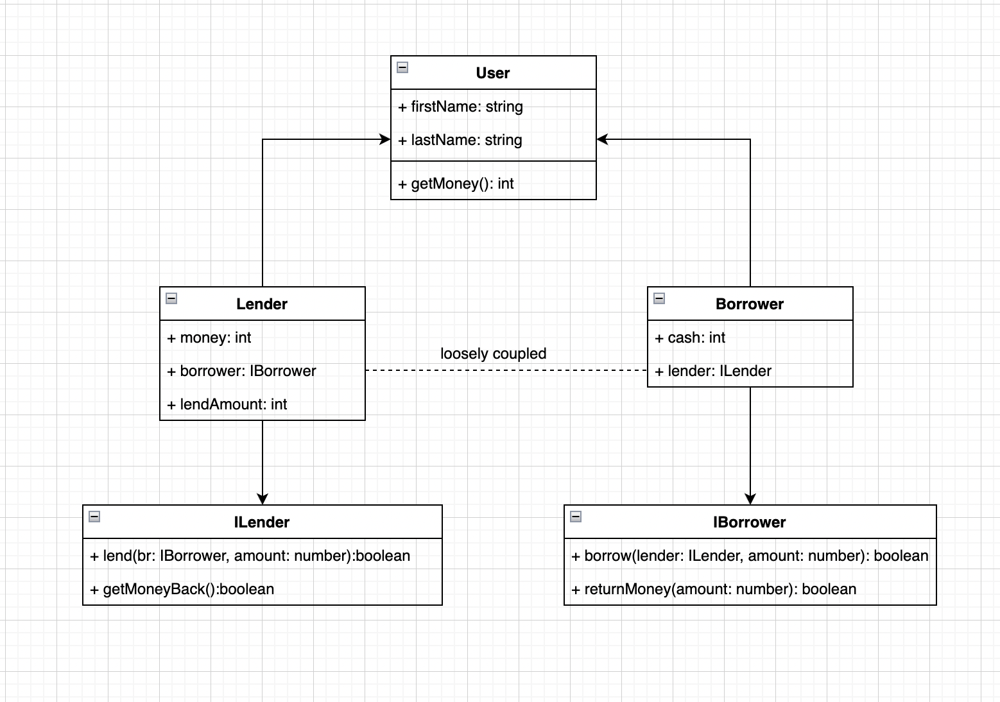
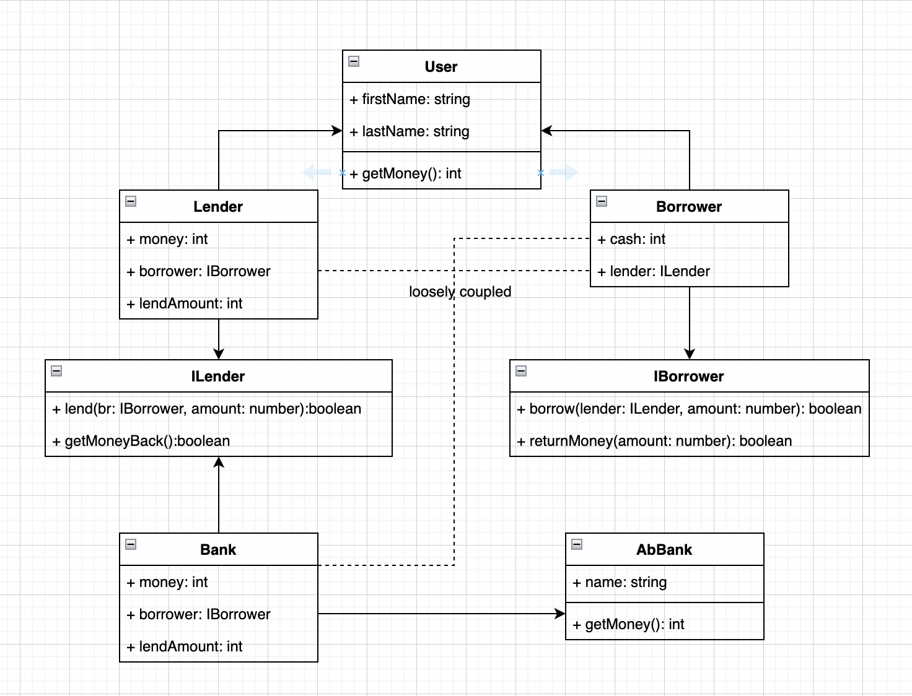

# 1. Please flow step by step to run this project

# Install Node & npm

    https://nodejs.org/en/download

# Clone source code

    git clone https://github.com/tonytran88/oven-backend-test.git

# CD to root folder

    cd oven-backend-test

# Install package

    npm install

# Build

    npx tsc

# Run Test

    npm start

# 2. SOLID Principles

# Single Responsibility Principle (SRP)

    abstract class User {
        firstName: string
        lastName: string
        constructor(firstName: string, lastName: string) {
            this.firstName = firstName
            this.lastName = lastName
        }

        abstract getMoney(): number
    }

# Open-Closed Principles (OCP)

    class Lender extends User  {
        ...
    }
    or
    class Borrower extends User  {
        ...
    }

# Liskov Substitution Principle (LSP)

    class Lender extends User  {
        ...
        getMoney(): number {
            return this.money
        }
    }

    class Borrower extends User  {
        ...
        getMoney(): number {
            return this.cash
        }
    }

# Interface Segregation Principle (ISP)

    interface ILender {
        lend(br: IBorrower, amount: number):boolean
        getMoneyBack():boolean
    }

    interface IBorrower {
        borrow(lender: ILender, amount: number): boolean
        returnMoney(amount: number): boolean
    }

# Dependency Inversion Principle (DIP)

    class Borrower extends User implements IBorrower {
        ...
        lender?: ILender //-->DIP
        borrow(lender: ILender, amount: number): boolean { //lender: ILender --> DIP
            if (this.lender != null || !lender.lend(this, amount)) {
                return false
            }

            this.lender = lender
            this.cash += amount

            return true
        }
        ...
    }

# 3. Class Diagram

# Refactor a tightly coupled lending system to a loosely coupled.

# When we handle more than 2 entities besides Lender and Borrower. Example: we may have another entity in this test - A Bank entity, that acts as a lender.

